# Project Presentation

### Brief Application Description

This project has been successfully completed as part of my coursework for **Introduction to TypeScript** during semester 1 of my sophomore year at Saint Jean Ingenieur. Throughout this project, I aimed to achieve specific learning outcomes and apply key concepts learned in class.

**Evntly** is a sleek, glassmorphism-inspired event management platform designed for educational campus environments. It serves as a centralized hub where students can discover upcoming school activities and admins can manage event logistics in real-time.

- **Core Concept:** A "Self-Service" portal for event discovery and seat reservation.
- **The Problem it Solves:** Replaces messy email chains and paper sign-up sheets with a digital, real-time "Sold Out" tracking system.
- **Branding:** A high-energy "Minion-Yellow" theme that balances playfulness with a modern, professional dark/light mode interface.

### Functional Goals

The project was built around three primary pillars: **Accessibility**, **Management**, and **User Experience**.

#### For Students (End Users)

- **Discovery:** Browse events by category (Workshops, Sports, etc.) using dynamic filters.
- **Registration:** One-click booking with instant visual feedback (✅ Registered).
- **Information:** View full event descriptions and locations through an interactive modal system.

#### For Administrators

- **Event Creation:** Dedicated panel to add events with specific titles, dates, locations, and descriptions.
- **Capacity Control:** Admins define total seat counts; the system automatically tracks "Current Bookings" to prevent over-registration.
- **Role-Based Access:** Pre-defined admin credentials ensure that only authorized users can modify the event database.

### Tech Stack: Why TypeScript + HTML/CSS?

The project intentionally avoids heavy frameworks to demonstrate mastery over the core web languages while using modern development practices.

#### TypeScript (The Brains)

- **Type Safety:** We defined strict User and SchoolEvent interfaces to ensure data consistency across the login and dashboard pages.
- **Modular Logic:** Used the StorageService pattern to encapsulate localStorage logic, making the data feel like a real database.
- **Dynamic UI:** TypeScript handles the "Virtual Rendering" of event cards, updating the DOM instantly without a page refresh.

#### HTML5 & CSS3 (The Body)

- **Glassmorphism:** Used `backdrop-filter: blur()` and semi-transparent backgrounds to create a modern, layered UI.
- **Responsive Design:** Implemented CSS Grid and Flexbox so the dashboard transitions smoothly from desktop monitors to mobile phones.
- **Theme Engine:** Used CSS Variables (`--primary-yellow`, `--card-bg`) to switch between light and dark modes with a single class toggle.

#### Key Technical Achievement: Capacity Logic

A standout feature of the code is the Atomic Update logic. When a user clicks "Book," the TypeScript engine:

1. Checks if `currentBookings < capacity`.
2. If true, it updates the User object (adding the ID).
3. Simultaneously updates the Event object (incrementing the count).
4. Re-renders the UI to show "Sold Out" to all other users.

---

## Implemented Features

##### PROJECT STATUS: IMPLEMENTED FEATURES

| FEATURE                 | STATUS | NOTES                       |
| ----------------------- | ------ | --------------------------- |
| Create Events           | OK     | Admin-only panel functional |
| Display Full Event List | OK     | Dynamic grid rendering      |
| Filter Events           | OK     | Category-based filtering    |
| Event Detail Page       | OK     | Modal-based view logic      |
| User Registration       | OK     | Student account creation    |
| Duplicate Protection    | OK     | Prevents double-booking     |
| Capacity Control        | OK     | Real-time seat tracking     |
| Dark Mode / Responsive  | OK     | Variable-based theme toggle |


## Project Structure
   ```
    TS_SEMESTER_PROJECT/
    ├── index.html               # Landing Page
    ├── src/
    │   ├── main.ts              # Landing page logic
    │   └── Pages/
    │       ├── login.html       # Auth Page
    │       ├── about.html       # Mission Page
    │       └── events.html      # Dashboard Page
    ├── styles/
    │   ├── main.css             # Landing & Global styles
    │   ├── login.css            # Auth styles
    │   └── events.css           # Dashboard & Modal styles
    ├── dist/                    # Compiled JavaScript (Ignored by Git)
    │   └── models/
    │   |   ├── app.js
    │   |   ├── login.js
    │   |   ├── storage.js
    │   |   └── models.js
    |   ├──main.js
    |
    ├── models/                  # TypeScript Source
    │   ├── app.ts               # Dashboard logic
    │   ├── login.ts             # Auth logic
    │   ├── storage.ts           # Data engine
    │   └── models.ts            # Type definitions
    ├── .gitignore               # Git rules
    └── tsconfig.json            # TS Compiler settings
   ```
## Setup & Execution

1. **Prerequisites**
    
    - You need **Node.js** installed. This allows you to use npm to manage TypeScript.
2. **Installation**
    
    - Open your terminal in the project folder and run:
        

bash

- - `# Install the TypeScript compiler globally npm install -g typescript`
        
- **Compiling the Code**
    
    - Because browsers don't speak TypeScript, you must convert it to JavaScript:

bash

1. - `# Run the compiler tsc`
        
    - This creates the `dist/` folder containing the runnable files.
2. **Running the App**
    
    - Open **VS Code**.
    - Right-click `index.html` and select "Open with Live Server."
    - Note: You must use a server (like Live Server) because the project uses "Modules," which browsers block if you just double-click the file from your folder.

---

## How to Use Evntly

### Create an Event

- Only users logged in as Admin (**[admin@school.com]**) can see the management tools.
- Click the "+ Create New Event" button on the dashboard.
- Fill in the event details: Title, Date, Category, and Capacity (the total number of seats).
- Click "Save Event"; the event will instantly appear in the "All Events" list for everyone.

### Filter/Search

- To find specific activities without scrolling:
    - Locate the "Filter by" dropdown menu above the event list.
    - Select a category (e.g., Workshops or Sports).
    - The list will automatically refresh to show only events matching that selection.

### How to Register as a User

- Registration is designed to be fast and intuitive:
    - Browse the "All Events" list.
    - Click "View Details" to read the full description and location.
    - If seats are available, click the "Book Seat" button.
    - The button will change to a green "✅ Registered" badge, and the event will be added to your personal "My Booked Events" section.

### What Happens When an Event is Full

- The system uses real-time capacity tracking to prevent overbooking:
    - The "Seats Left" counter hits **0**.
    - The event card displays a red "Sold Out" status.
    - The "Book Seat" button becomes disabled (grayed out) and unclickable, ensuring the physical capacity of the venue is respected.

---

## Screenshots

### Home Page
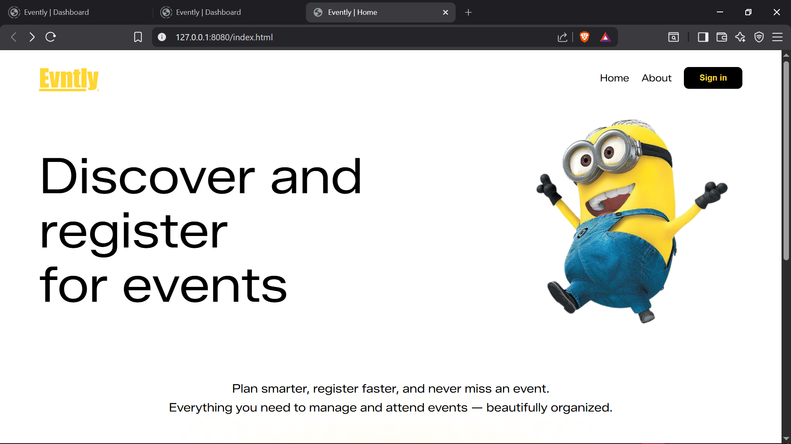
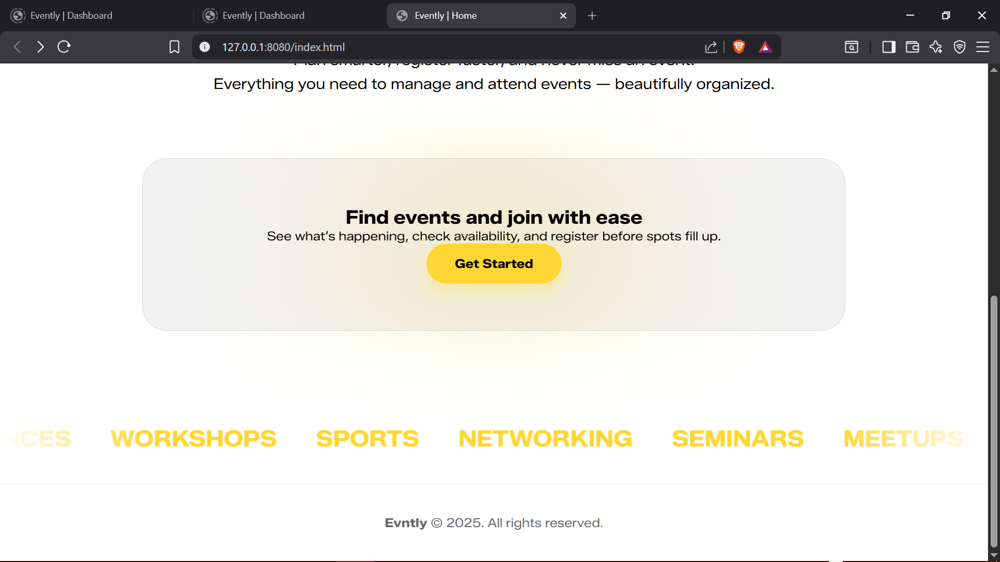

### Login/Create Account Form
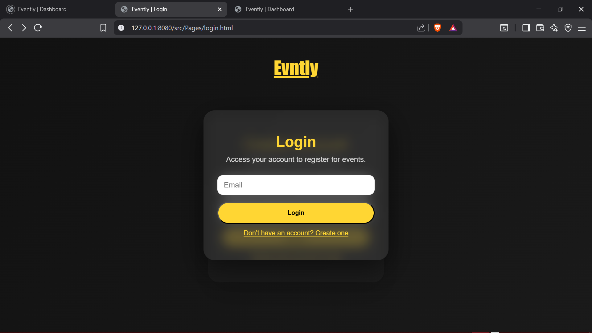
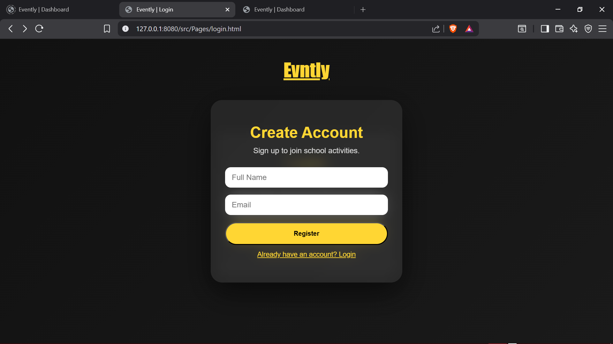

### Event Page
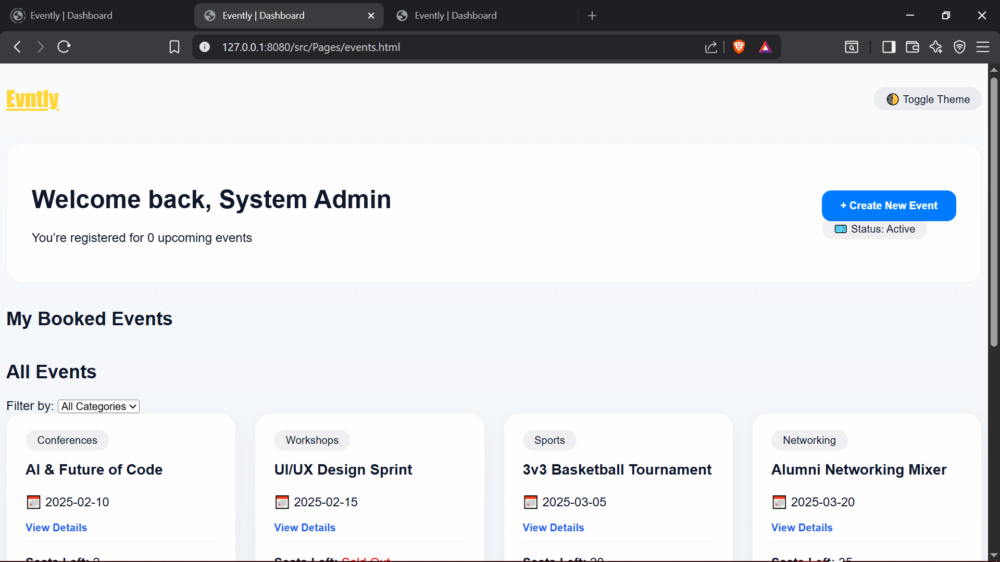
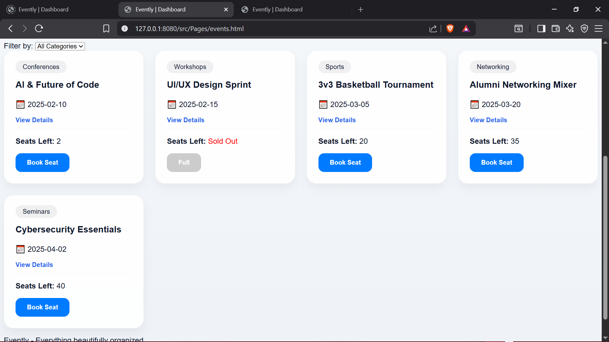
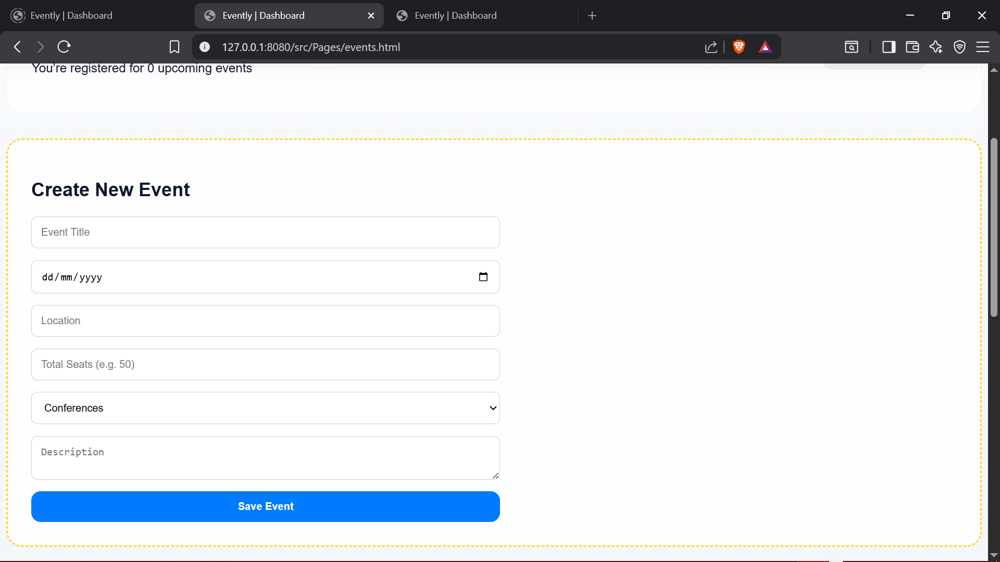
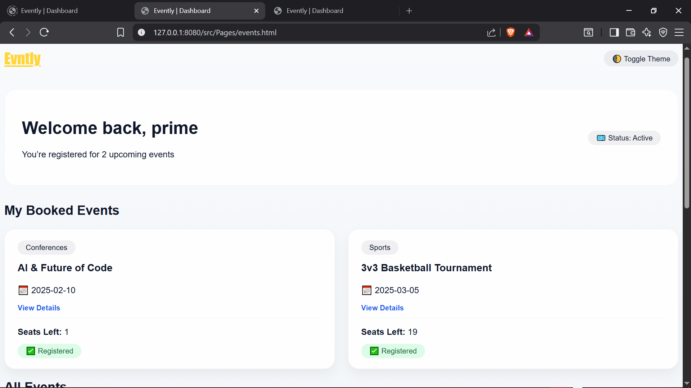
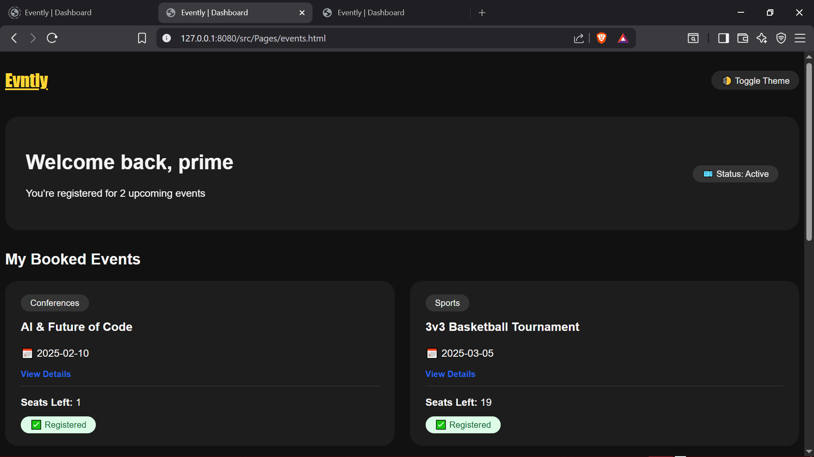

### Mobile View
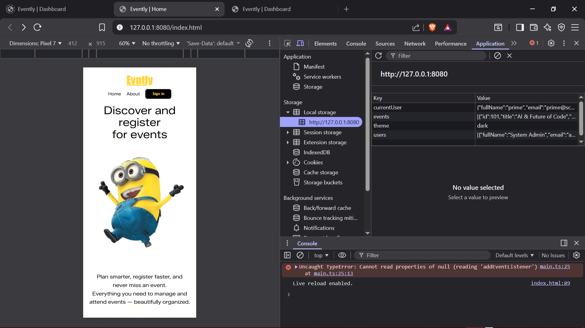
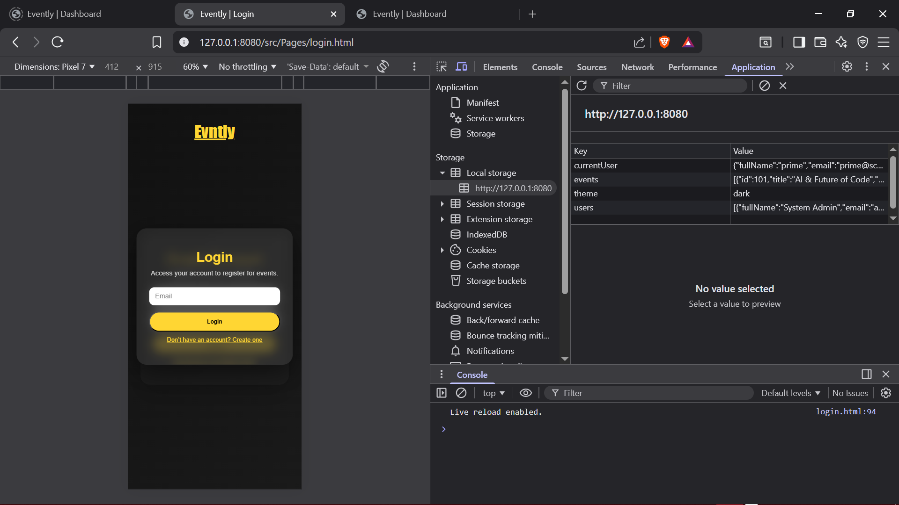
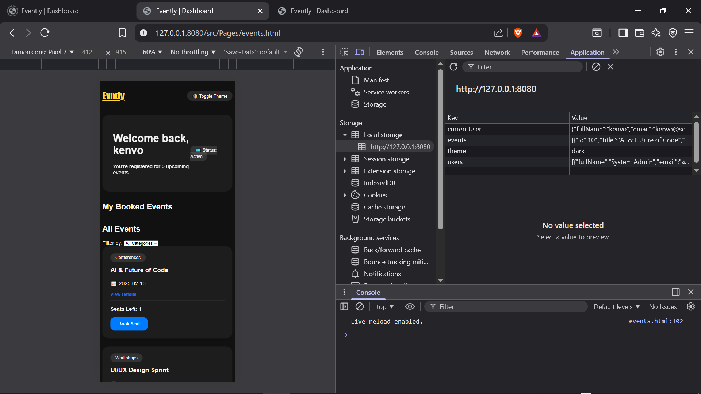

## Conclusions and Limitations

### Project Evaluation

The **Evntly** platform successfully delivers a streamlined event management experience by leveraging TypeScript’s strong typing to prevent runtime errors. Its primary strength lies in its real-time capacity tracking and a clean, responsive UI that ensures a seamless user experience across devices. By centralizing the admin and student workflows into a single interface, the project automates registration logic that is typically prone to human error.

### Technical Difficulties

The most significant challenge was managing persistent state across multiple pages. Relying on localStorage required rigorous JSON serialization and deserialization, leading to initial bugs where user data would "vanish" during page redirects. Additionally, refactoring the CSS transitions proved difficult; moving from `display: none` logic to opacity and transform states was necessary to maintain a professional, "snappy" feel without breaking the layout or interfering with DOM events.

### Future Improvements

To scale this application, the next steps would involve:

- **Database Integration:** Transitioning from localStorage to a Node.js/Express backend with MongoDB to allow for permanent, multi-user data storage.
- **Enhanced Security:** Implementing real password hashing (e.g., Bcrypt) and JWT (JSON Web Tokens) for secure authentication, as the current "email-only" login is intended only for local demonstration.
- **Waitlist Logic:** Adding a feature where students can join a queue for full events, automatically notifying them if a seat becomes available.


## Author Information

|FIELD                        | FILL IN                             |
| ----------------------------|--------------------------------------
| Full Name                   | Kenvo Fomazou Samuel                |
| Student ID                  | 2425L038                            |
| Email                       | samuel.kenvo@saintjeantingenieur.org|
    


   
